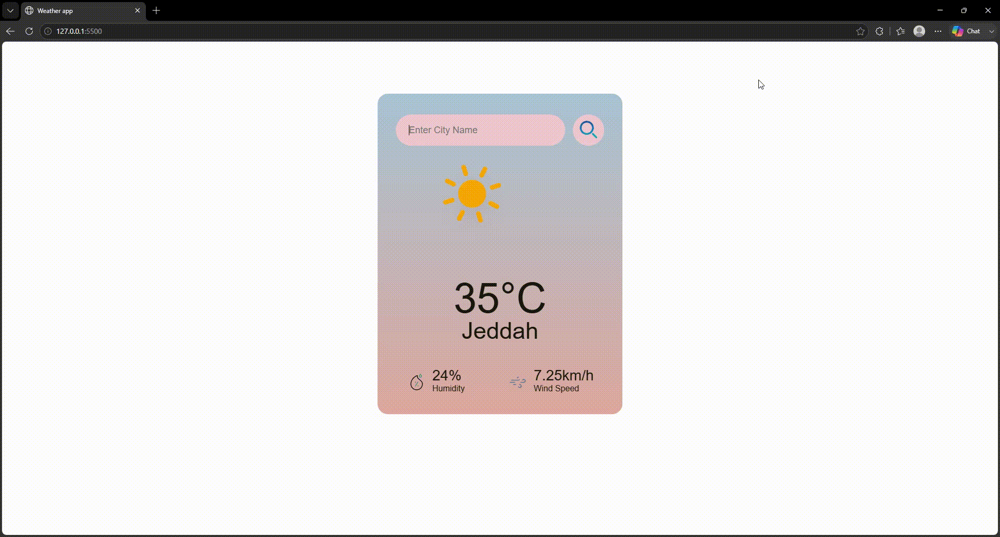
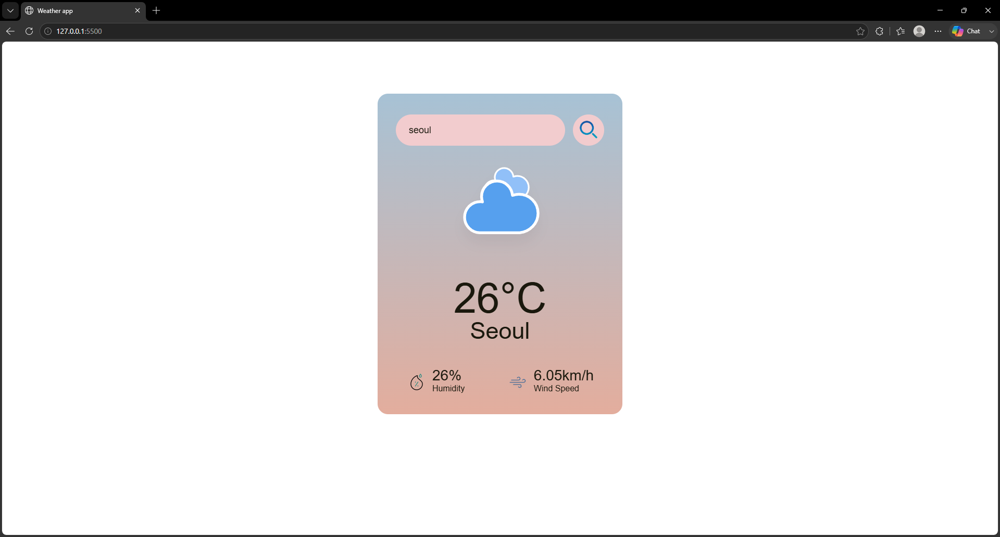

# 🌤️ Weather App
## 🚀 Live Demo

<p align="center">
  <a href="https://shahad-alzuwayhiri.github.io/weather-app/" target="_blank">
    🌐 Click here to view the app
  </a>
</p>

A simple and responsive weather application that provides real-time weather information for cities around the world using the OpenWeatherMap API.

## 🚀 Features

* Search for any city worldwide
* Display current temperature in Celsius
* Show humidity percentage
* Show wind speed
* Dynamic weather icons based on weather conditions
* Error handling for invalid city names
* Responsive design

## 🛠️ Technologies Used

* HTML5
* CSS3
* JavaScript (ES6)
* OpenWeatherMap API


## 📸 Preview

### Demo
<p align="center">
  
</p>

### Screenshot
<p align="center">
  
</p>

> 

## 📦 Installation

Clone the repository:

```bash
git clone https://github.com/Shahad-Alzuwayhiri/weather-app
```

Open the project folder and run:

```text
index.html
```

in your browser.

## 📡 API

Weather data is provided by OpenWeatherMap:

https://openweathermap.org/api

## 🎨 Weather Icons

This project uses weather icons from:

https://github.com/Makin-Things/weather-icons

Credits belong to the original creator of the icon set.

## 🔮 Future Improvements

* 5-day weather forecast
* Search using Enter key
* Current location weather
* Dark mode
* Loading animation

## 👩‍💻 Author

Shahad Saad

GitHub:
https://github.com/Shahad-Alzuwayhiri

---

⭐ Feel free to fork this repository and give it a star if you found it useful.
